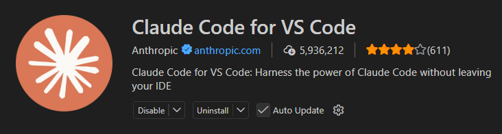
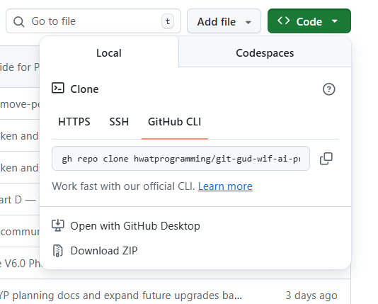
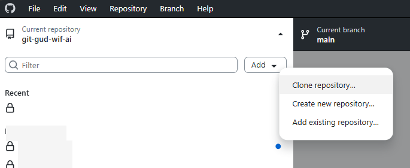
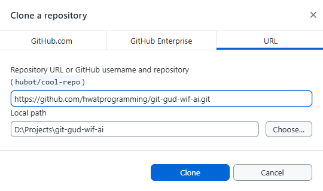
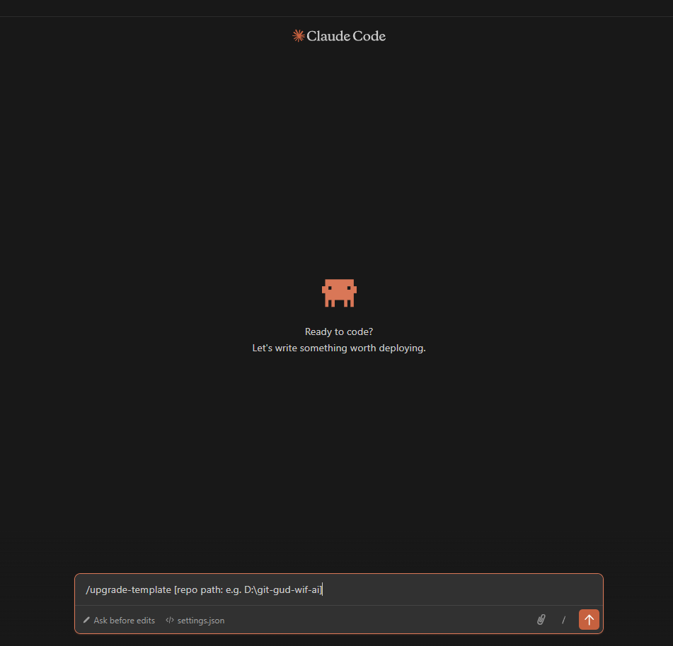

# git-gud-wif-ai

A Claude Code project template with 34 skills, 6 subagents, automated hooks, and a layered context system — built from a month of daily usage across real projects.

**Who this is for:**
- People with basic knowledge of software development workflows
- People willing to let Claude handle the heavy lifting after giving it good prompts
- People who want structure and guardrails when working with AI coding assistants

**Who this might not suit:**
- Advanced developers who want less reliance on Claude and more manual control

## Disclaimer

**Back up your work before using this template.** This template gives Claude Code significant autonomy — it can create, modify, and delete files as part of its workflow. While there are safety hooks (e.g. blocking direct pushes to main, denying `rm -rf`), things can still go wrong.

**This entire template — every skill, subagent, hook, and config file — was generated by Claude Code (Opus 4.6) through iterative prompting.** No code was hand-written. The quality and behavior of the template reflect what the AI produced given my prompts and feedback across ~1 month of iteration. It works well for my workflows, but your mileage may vary. I cannot guarantee anything — no warranty, no support, no promises that it won't break your project. Use at your own risk. Git is your friend — commit early, commit often, and make sure you have a way to roll back.

## Prerequisites

- **Claude Code** — install using one of:
  - **VS Code** (easiest): Open the Extensions panel (`Ctrl+Shift+X`), search "Claude Code", and install the one by Anthropic
  
  

  - **CLI**: Follow the [install guide](https://docs.anthropic.com/en/docs/claude-code)

- A Claude **Pro** or **Max** subscription
- **Git** — either the [command line](https://git-scm.com/downloads) or [GitHub Desktop](https://desktop.github.com/) (easier for beginners)

## How to Install

There are two ways to install: **clone + `/upgrade-template`** (recommended) or **download ZIP + manual copy**.

---

### Option A: Clone + `/upgrade-template` (Recommended)

**Step 1: Clone this repo**

Clone this repo somewhere on your machine — this is your local copy of the template.

**GitHub Desktop**: Click the green **Code** button on this repo's GitHub page, then "Open with GitHub Desktop".

<details>
<summary>GitHub Desktop step-by-step</summary>

1. Copy the repo URL from the GitHub page

   

2. In GitHub Desktop, go to `File > Clone Repository`

   

3. Paste the URL and choose where to save it

   

</details>

**Command line**: `git clone https://github.com/hwatprogramming/git-gud-wif-ai.git`

**Step 2: Install the template into your project**

Open Claude Code inside your project and run:

```
/upgrade-template [path to your project]
```

This detects your existing `.claude/` and `.agents/` directories and asks whether to overwrite, merge, or keep each file. Works for both new and existing projects — including projects that already have an older version of this template.



Don't have a project yet? Create a folder, initialize git (`git init` or create a new repo via GitHub Desktop), then open it in VS Code and run the command above.

---

### Option B: Download ZIP + Manual Copy

1. Download the ZIP from the green **Code** button on this repo's GitHub page

   

2. Extract it and copy `.claude/`, `.agents/`, and `CLAUDE.md` from `Claude-Code-Template-V6.5.1/` into your project root

---

### Start using it

1. Run `/template-info` to verify the template is installed
2. Pick your workflow:

```
Help:              /help (recommended for first-time users)
Session start:     /prime
New project:       /new-project → /create-prd → /setup
Feature / bug fix: /describe → /plan → /execute → [auto-pipeline] → /commit
Existing codebase: /thrown-into-someones-hell-hole (orchestrates full pipeline)
Full testing:      /test-everything → suggests /release
Release:           /release (orchestrates /qa → /security-audit → /create-pr)
Doc cleanup:       /sync-docs (anytime — archive plans, sync docs)
```

## Managing Context (Important)

Claude Code has a limited context window. When it fills up, it **compacts** — summarizing earlier messages to free space. This loses detail and can cause Claude to forget what it was doing. Personally, one or two compactions per session is what I'm comfortable with — beyond that the results can become unpredictable.

**Best practices:**

- **Always start sessions with `/prime`** — this loads your project context so Claude knows where it is
- **Before context gets too long, run `/update-progress`** — this saves what you've done and what's left to a handoff doc
- **Then start a new session** (click the Claude icon in VS Code, or run `claude` in terminal) and run `/prime` to pick up where you left off
- **Aim for one or two compactions max per session** — if you're hitting more, it's time to start fresh
- **Keep sessions focused** — one feature or task per session works better than marathon sessions

**The pattern:**

```
Start session:     /prime
Do work:           /describe → /plan → /execute → ...
Before it gets long: /update-progress
New session:       /prime → continue from where you left off
```

This is how the template is designed to work — `/prime` reads your project state, `/update-progress` writes it. Together they give you clean session handoffs without losing context.

## Token & Rate Limits

The template itself is lightweight — **~6,000-8,000 tokens** loaded per turn (~3-4% of the 200k context window). Skills load on-demand, adding ~400-1,400 tokens each.

**What actually matters is your plan's rate limit.** In Claude Code, one user message can trigger multiple API calls (tool use, subagents, chained skills). Here's what to expect:

| Plan | Opus msgs / 5 hrs | Sonnet msgs / 5 hrs | What you get |
|------|-------------------|---------------------|--------------|
| Pro ($20/mo) | ~45 | ~80 | One full feature cycle per window |
| Max ($100/mo) | ~225 | ~400 | Comfortable full-day work |
| Max ($200/mo) | ~900 | ~1,600 | Effectively unlimited |

**Tips for Pro plan users:**
- Use **Sonnet for heavy execution** (`/execute`, `/test`) — it gets ~2x the quota
- Use **Opus for thinking** (`/describe`, `/plan`, `/review`) — these are low-turn skills
- Avoid redundant chains — `/execute` already runs test + review + check
- Batch your context — give `/describe` everything upfront instead of drip-feeding

**Max plan users** can use Opus freely and let full pipelines chain without worrying about limits.

See [references/token-and-rate-limit-guide.md](references/token-and-rate-limit-guide.md) for detailed turn counts per skill and session budgets.

## What's Inside

### Repo Structure

```
git-gud-wif-ai/
├── Claude-Code-Template-V6.5.1/   # The template — copy into your projects
│   ├── .claude/                    # Skills, subagents, hooks, rules, reference docs
│   ├── .agents/                    # Plans, progress docs (created by /setup)
│   ├── CLAUDE.md                   # Project context template
│   └── README.md                   # Full template documentation
├── references/                     # Images and reference material
├── LICENSE                         # MIT License
└── README.md                       # You are here
```

### 34 Skills

| Category | Skills |
|----------|--------|
| **Setup** | `/new-project`, `/create-prd`, `/setup` |
| **Planning** | `/prime`, `/describe`, `/plan` |
| **Development** | `/execute`, `/restart-dev` |
| **Brownfield** | `/investigate`, `/triage`, `/safe-fix`, `/thrown-into-someones-hell-hole`, `/deep-analysis` |
| **Quality** | `/check`, `/review`, `/qa` |
| **Testing** | `/test`, `/test-everything`, `/release` |
| **Security** | `/security-audit`, `/remove-personal-info` |
| **Git** | `/commit`, `/create-pr`, `/update-progress`, `/execution-report`, `/sync-docs` |
| **Meta** | `/help`, `/template-info`, `/create-skill`, `/manage-skills`, `/find-skills`, `/toggle-visibility`, `/upgrade-template`, `/audit-pipeline` |

### 6 Subagents

| Agent | Model | Purpose |
|-------|-------|---------|
| code-reviewer | Haiku | Reviews changed files for bugs, security, patterns |
| test-planner | Haiku | Validates test plan structure and data strategy |
| session-cleanup | Haiku | End-of-session housekeeping |
| rca | Sonnet | Classifies errors and traces root causes |
| code-specter | Sonnet | Deep specification work with web research |
| researcher | Sonnet | External research with citation validation |

### Automated Hooks

- Branch safety — blocks direct push to main
- Session start — reminds user to run `/prime`
- Context recovery — re-reads CLAUDE.md after compaction

## Template Evolution

This template went through 6 major versions over ~1 month:

| Version | What Changed |
|---------|-------------|
| V1 | CLAUDE.md + skills system |
| V2 | PIV Loop, quality gates, reflection cycle |
| V3 | Professional planning, code review workflow |
| V4 | Discovery layer, session continuity, single unified template |
| V5 | Subagents, hooks, rules system, leaner CLAUDE.md |
| V6 | 50% token compression, pipeline revision, permissions security audit |

## About Me

I'm a university CS student — and honestly, not the strongest one technically. Most of you can probably code circles around me and understand software engineering concepts way better than I do.

I've always had a lot of ideas, but the lack of technical skills held me back from actually building anything. The rise of AI and agentic coding changed that. Now I'm building stuff with Claude Code for both work and personal projects, and it's been incredible.

That said, I still believe we should learn proper computing and software knowledge so we're not entirely at the mercy of AI. This template is the result of about a month of exploring Claude Code features, iterating on workflows, and figuring out what actually works.

I'd love to share this with you. If you try it, let me know how it feels to use — feedback and comments are welcome.

## License

MIT License. See [LICENSE](LICENSE) for details.

## Credits

This template would not exist without [Cole Medin](https://github.com/coleam00). His [video on Claude Code workflows](https://www.youtube.com/watch?v=ttdWPDmBN_4) and [habit-tracker repo](https://github.com/coleam00/habit-tracker/tree/main) introduced me to proper agentic coding workflows — the PIV Loop, structured planning, and quality gates that became the foundation of this template. V2 and V3 were built directly on patterns from his work.

*This is a credit, not an endorsement. I am not affiliated with and do not endorse any products, services, or paid offerings from any credited individuals.*